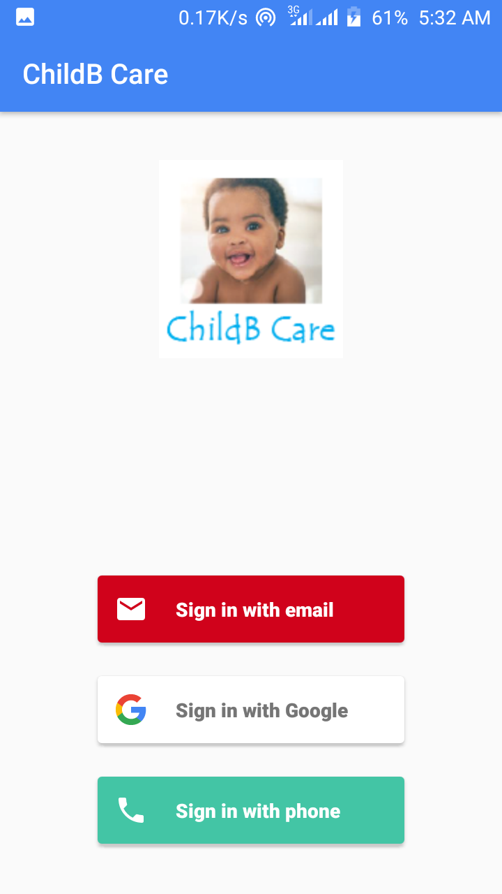
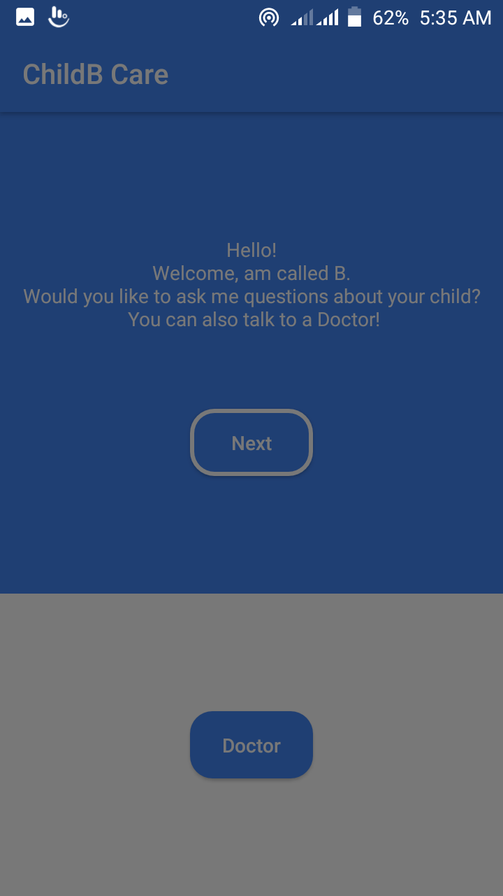
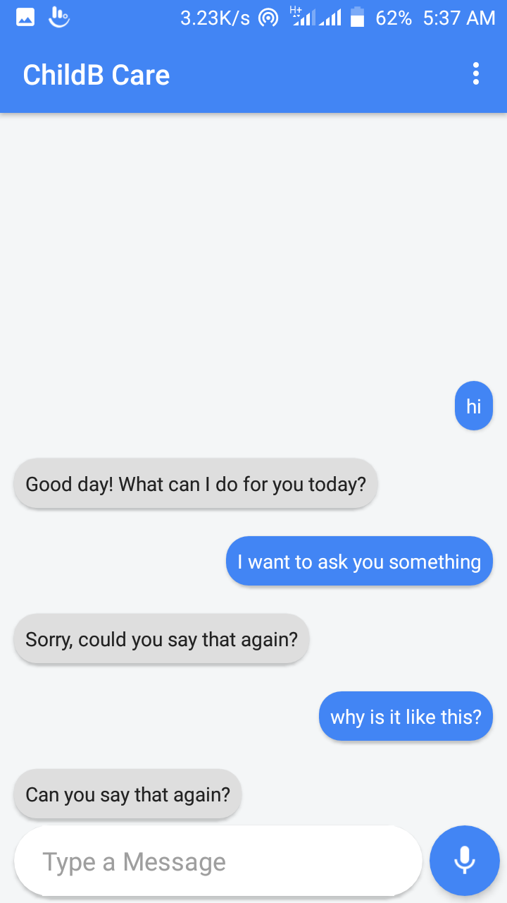
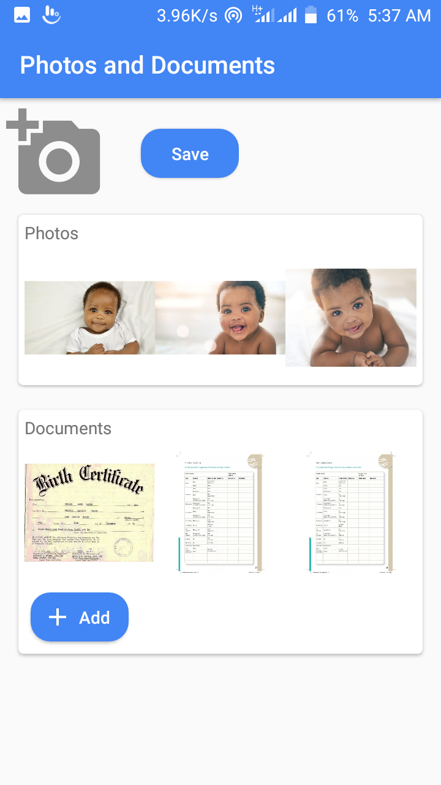
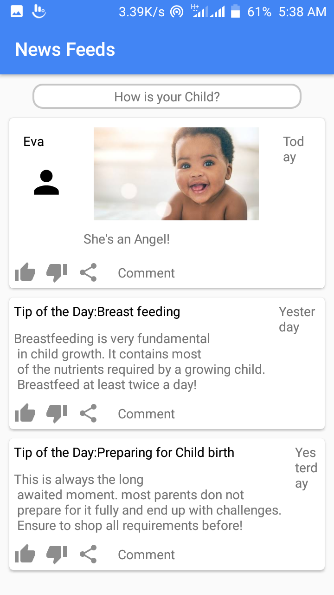

# Child Birth Care App
||
||

This is an app that can connect expecting mothers to doctors.
It can also help a mother store birth certificates after birth.
The mother can also share and make post about her child and 
at the same time be able to read about more information on how 
to take care of the baby and also read about what other mothers are 
experiencing with their children and how they solve some issues.
This is an intermediate level project 

## Table of Contents
* [Features](#features)
* [Setup](#setup)
* [License](#license)
### Features
* Firebase Authentication login
* Card view layout
* Chat bot
* News feeds
* Call functionality
* File upload functionality
### Setup
* Install [Android studio](https://developer.android.com/studio)
* Install [Android Development Tools](https://docs.oracle.com/en/middleware/developer-tools/jet/tutorials/jetma/index.html)
####Gradle
    gradle-5.4.1-all.zip
####dependecies

    implementation 'androidx.constraintlayout:constraintlayout:1.1.3'
    implementation 'androidx.legacy:legacy-support-v4:1.0.0'
    implementation 'com.android.support:cardview-v7:28.0.0'
    implementation 'com.android.support:recyclerview-v7:28.0.0'
    implementation 'com.android.support:design:28.0.0'
    implementation 'com.google.firebase:firebase-analytics:17.2.0'
    implementation 'com.google.firebase:firebase-database:19.1.0'
    implementation 'com.google.firebase:firebase-auth:19.0.0'
    implementation 'com.firebaseui:firebase-ui-auth:4.3.1'
    implementation 'com.firebaseui:firebase-ui-database:2.3.0'
    implementation 'ai.api:sdk:2.0.7@aar'
    implementation 'ai.api:libai:1.4.8'
    implementation 'com.google.code.gson:gson:2.8.5'

    // Adds libraries defining annotations to only the compile classpath.
    compileOnly 'com.google.dagger:dagger:2.24'
    // Adds the annotation processor dependency to the annotation processor classpath.
    annotationProcessor 'com.google.dagger:dagger-compiler:2.24'
    annotationProcessor 'org.apache.logging.log4j:log4j-core:2.2'

####TODO
    Implement file display functionality
    Implement News feeds
    Implement Call functionality
### License
This project is licensed under [MIT license](./LICENSE.md) terms